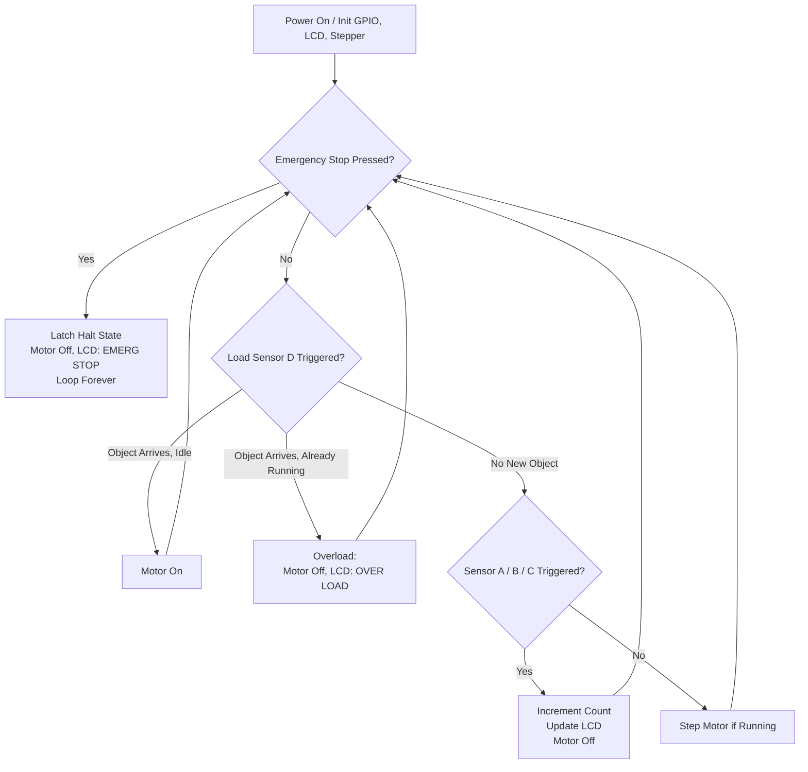

# 🏭 Automated Object Sorting Conveyor System

**Embedded object detection, counting, and sorting on a TM4C123GH6PM-driven conveyor line**


---

## Overview

This project is a bare-metal embedded system that turns a small conveyor rig into an automated object-counting and sorting line. It was built as a semester project for a Mechatronics and Control Engineering course, combining register-level embedded programming, custom PCB design, and a mechanical conveyor assembly into a single working prototype.

Four IR sensors watch the belt, a NEMA-17 stepper motor (driven through a TB6600 controller) moves objects along it, a 16×2 LCD reports live counts and system state, and a hardware emergency stop can halt everything instantly. The goal was to demonstrate — end to end — how sensing, actuation, and safety logic come together in a small-scale industrial automation setup.

**Why it matters:** conveyor-based sorting is one of the most common patterns in manufacturing and logistics automation. Building it from the register level up (no HAL, no RTOS) forces a real understanding of GPIO configuration, polling-based sensor logic, LCD timing, and motor control — the fundamentals that sit underneath higher-level industrial control systems.

---

## Key Features

**Sensing & Counting**
- Four independent IR sensor channels (`SENSOR_A`–`SENSOR_D`) for object detection
- Per-channel debounced counting logic to avoid double-counting objects
- Dedicated "load" sensor (`SENSOR_D`) that gates motor start/stop and flags an overload condition if an object arrives while the conveyor is already busy

**Motion Control**
- Step/direction control of a NEMA-17 stepper motor via a TB6600 driver
- Motor automatically starts on object arrival and stops once a sensor registers a count
- Conveyor motion is fully gated by the emergency stop and overload states

**Status Feedback**
- 16×2 character LCD (4-bit interface) showing live per-channel object counts
- Real-time text status messages: `Motor ON`, `Motor OFF`, `OVER LOAD`, `EMERG STOP`
- Three-LED status bank (green / yellow / red) reflecting run, warning, and fault states

**Safety**
- Dedicated emergency-stop input (Port F, `SW1`) with software debounce
- Once triggered, the system latches into a halted state (motor off, fault LEDs on, LCD message shown) until a hardware reset — a deliberate fail-safe design choice for an industrial context

---

## Technologies & Tools

| Category | Details |
|---|---|
| **Microcontroller** | Texas Instruments TM4C123GH6PM (Tiva C Series LaunchPad) |
| **Language** | Embedded C (bare-metal, direct register access — no vendor HAL) |
| **IDE / Toolchain** | Keil MDK-ARM (µVision) |
| **Motor Control** | NEMA-17 stepper motor + TB6600 microstepping driver |
| **Sensing** | 4× IR proximity sensors |
| **Display** | 16×2 character LCD (HD44780-compatible, 4-bit mode) |
| **Hardware** | Custom PCB, BC547 transistor switching, status LEDs, push-button E-stop |
| **Power** | 12 V supply with 5 V regulation |
| **Mechanical** | Wooden conveyor frame, belt, rollers, shaft, coupler, ball bearings, sorting buckets |

---

## Hardware Architecture

### Pin Mapping

| Port | Function | Signals |
|---|---|---|
| Port A | IR Sensors | `SENSOR_A` (PA2), `SENSOR_B` (PA3), `SENSOR_C` (PA4), `SENSOR_D` / load sensor (PA5) — internal pull-ups enabled |
| Port B | LCD (4-bit interface) | RS, EN, D4–D7 |
| Port C | Status LEDs | Green (PC4), Yellow (PC5), Red (PC6) |
| Port D | Stepper Motor | Pulse (PD2), Direction (PD3) |
| Port F | Emergency Stop | SW1 input (PF4), internal pull-up enabled |

### System Flow



### Control Logic Summary

The main loop is a continuously polled state machine, structured around four priorities checked every cycle:

1. **Safety first** — the emergency-stop pin is checked before anything else. Once latched, the system halts permanently until reset.
2. **Load gating** — the entry sensor (`SENSOR_D`) starts the motor when an object arrives on an idle belt, or raises an overload flag (with LED and LCD feedback) if a second object arrives while the belt is still occupied.
3. **Recovery** — if the sort sensors (A/B/C) all clear, the overload flag and red LED are reset and the system is ready for the next cycle.
4. **Counting** — each of the three sort sensors independently debounces, increments its own counter, refreshes the LCD, and briefly stops the motor to let the object settle before the belt resumes.

---

## Repository Structure

```
uVision_Keil_Project_09_B/
├── uVision_Keil_Project_09.c        # Main application: GPIO, LCD, stepper, sensor & safety logic
├── uVision_Keil_Project_09.uvprojx  # Keil uVision project file
├── uVision_Keil_Project_09.uvoptx   # Keil project options
├── RTE/
│   ├── Device/TM4C123GH6PM/
│   │   ├── startup_TM4C123.s        # Startup/vector table for TM4C123
│   │   └── system_TM4C123.c         # System/clock initialization
│   ├── _TM4C123GH6PM/RTE_Components.h
│   └── _Target_1/RTE_Components.h
├── Objects/                          # Build outputs (.axf, .o, .map, .dep, build log)
└── Listings/
    └── uVision_Keil_Project_09.map  # Linker memory map
```

> The `Objects/` folder contains compiled build artifacts from Keil and is not required to rebuild the project — it can be safely deleted and regenerated.

---

## Getting Started

### Prerequisites

- [Keil MDK-ARM (µVision)](https://www.keil.com/download/product/) with the **Tiva C Series (TM4C)** device pack installed
- A TM4C123GH6PM LaunchPad (or equivalent Tiva C board)
- USB cable for programming/debugging (Stellaris/Tiva ICDI)

### Build & Flash

1. **Clone the repository**
   ```bash
   git clone https://github.com/andreyas-dev/Automated_Object_Sorting_Conveyor_System.git
   cd uVision_Keil_Project
   ```
2. **Open the project**
   Launch Keil µVision and open `uVision_Keil_Project_09.uvprojx`.
3. **Build**
   `Project → Build Target` (or `F7`). Output binaries are generated in `Objects/`.
4. **Flash**
   Connect the LaunchPad via USB, then `Flash → Download` (or `F8`) to program the device.

### Wiring Summary

Connect according to the [pin mapping](#hardware-architecture) above:
- IR sensors → Port A (PA2–PA5)
- LCD (4-bit) → Port B
- Status LEDs → Port C (via BC547 transistor stages)
- TB6600 stepper driver (PUL/DIR) → Port D
- Emergency-stop push button → Port F (PF4)

---

## Mechanical Build

The physical rig consists of a wooden conveyor frame carrying the belt over rollers mounted on a shaft with a coupler and ball bearings, driven by the NEMA-17 stepper. Sorted objects are directed toward separate buckets positioned along the belt.

> **Note:** in the current prototype, diversion of sorted objects into their respective buckets is performed manually rather than by an automated actuator — the embedded system handles detection, counting, motor control, and status reporting, while final physical sorting is assisted by hand.

---

## Engineering Challenges & Solutions

| Challenge | Solution |
|---|---|
| Debouncing four IR sensors on a moving belt without an RTOS | Software debounce via short polling delays and per-sensor "handled" flags to prevent recounting the same object |
| Detecting a jam/overload condition | Load sensor (`SENSOR_D`) tracks whether the belt is already occupied when a new object arrives, and raises a dedicated overload state with distinct LED/LCD feedback |
| Guaranteeing the emergency stop is always safe | E-stop check is placed first in every loop iteration and, once triggered, latches into an infinite halt loop — recoverable only by a hardware reset, not by software |
| Driving an HD44780-style LCD without a library | Custom 4-bit LCD driver written directly against Port B, including cursor addressing and numeric-to-ASCII conversion for the live count display |

---

## Future Improvements

- [ ] Automated bucket diversion (servo/solenoid actuator instead of manual sorting)
- [ ] Object classification (e.g. size/color) rather than simple presence counting
- [ ] Non-latching, software-resettable emergency stop with a dedicated reset input
- [ ] Data logging or a serial/UART interface for count history
- [ ] Adjustable stepper speed via potentiometer input
- [ ] Custom PCB revision with connector headers for easier reassembly

---

## Author

**Andreyas**
Mechatronics & Control Engineering Student
University of Engineering and Technology (UET), Lahore

Robotics • Embedded Systems • Automation • Computer Vision

📧 eng.andreyas@gmail.com
🔗 [LinkedIn](https://www.linkedin.com/in/eng-andreyas/)

---

⭐ If this project is useful or interesting to you, consider starring the repository.
🤝 Contributions, suggestions, and improvements are welcome — feel free to open an issue or pull request.
📩 Open to collaboration, research, and internship opportunities — reach out anytime.
